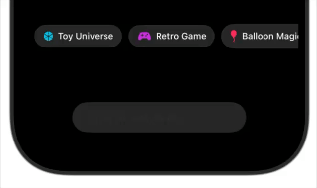

# Mobile Input Field Text Animation

A typing animation effect for mobile apps that types out text character-by-character when users select options. Creates a delightful, AI-like experience for prompt selection.

## What We're Building

When users tap on style pills/buttons, instead of text appearing instantly in the input field, it animates character-by-character like someone is typing it out.



**User Flow:**
1. User taps "Anime Style" pill
2. Input field animates: "T" → "Tr" → "Tra" → "Transform this into anime..."
3. Creates engaging, responsive AI interaction

---

## 🍎 For iOS Developer

### The Code That Works
```swift
struct YourView: View {
    @State private var displayedText = ""
    @State private var typingTask: Task<Void, Never>?

    func startTypingAnimation(_ text: String) {
        typingTask?.cancel()
        displayedText = ""
        
        typingTask = Task { @MainActor in
            for char in text {
                if Task.isCancelled { break }
                displayedText.append(char)
                try? await Task.sleep(nanoseconds: 8_000_000) // 8ms per character
            }
        }
    }
    
    var body: some View {
        VStack {
            // Your button
            Button("Anime Style") {
                startTypingAnimation("Transform this into anime art...")
            }
            
            // Your text field
            TextField("Prompt", text: $displayedText)
        }
        .onDisappear {
            typingTask?.cancel()
        }
    }
}
```

### Integration
- Add the two `@State` variables to your existing View
- Add the `startTypingAnimation` function to your existing View
- Call the function in your button actions
- Bind your text field to `$displayedText`

---

## 🤖 For Android Developer

### The Code That Works
```kotlin
import androidx.compose.runtime.*
import androidx.compose.ui.platform.LocalContext
import kotlinx.coroutines.*
import android.provider.Settings

@Composable
fun YourScreen() {
    var displayedText by remember { mutableStateOf("") }
    var typingJob by remember { mutableStateOf<Job?>(null) }
    val scope = rememberCoroutineScope()
    
    fun startTypingAnimation(text: String) {
        typingJob?.cancel()
        displayedText = ""
        
        typingJob = scope.launch {
            text.forEach { char ->
                if (!isActive) return@launch
                displayedText += char
                delay(8) // 8ms per character
            }
        }
    }
    
    // Cleanup when composable is disposed
    DisposableEffect(Unit) {
        onDispose { typingJob?.cancel() }
    }
    
    Column {
        // Your button
        Button(
            onClick = { startTypingAnimation("Transform this into anime art...") }
        ) {
            Text("Anime Style")
        }
        
        // Your text field
        TextField(
            value = displayedText,
            onValueChange = { displayedText = it },
            placeholder = { Text("Prompt") }
        )
    }
}
```

### Integration
- Add the state variables and scope to your existing Composable
- Add the `startTypingAnimation` function inside your Composable
- Add the `DisposableEffect` for cleanup
- Call the function in your button onClick handlers
- Bind your text field to `displayedText`

---

## Key Details

### Timing
- **8ms per character** feels natural (tested in prototype)
- Adjust if needed based on your testing

### Cancellation
- **Critical:** Always cancel previous animation before starting new one
- Prevents overlapping animations when users tap multiple pills quickly

### Accessibility
**iOS:**
```swift
if UIAccessibility.isReduceMotionEnabled {
    displayedText = text // Show instantly
} else {
    startTypingAnimation(text)
}
```

**Android:**
```kotlin
val context = LocalContext.current
val animationsEnabled = remember {
    Settings.Global.getFloat(context.contentResolver, Settings.Global.ANIMATOR_DURATION_SCALE, 1f) != 0f
}

if (animationsEnabled) {
    startTypingAnimation(text)
} else {
    displayedText = text // Show instantly
}
```

## Testing Notes
- Test rapid pill switching to ensure cancellation works
- Verify no memory leaks from uncanceled tasks
- Test with different text lengths

---

## Designer Notes
This was prototyped to show the intended behavior. The code above is production-ready and handles edge cases like cancellation and cleanup. The 8ms timing creates a natural typing feel without being too slow or robotic.